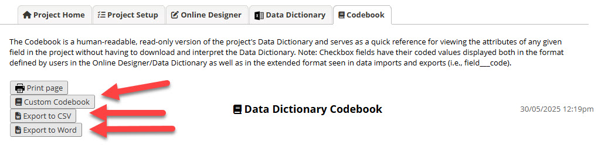

# Custom Codebook Data Dictionary (REDCap External Module)

**Custom Codebook** extends REDCap’s Codebook by adding:
- **Custom Codebook** (simplified in-app view)
- **Export to Word (.docx)** (data governance–friendly data dictionary)
- **Export to CSV** (export the codebook in CSV format)

When enabled, these buttons appear on the project **Codebook** page. The module **does not replace** the native REDCap Codebook.

---

## Background

Data dictionaries are commonly used in IT governance to document systems. As data governance has emerged, the need to properly **define and catalogue data elements** has made dictionaries central to governance practice.

In research projects (especially health research), REDCap is used not only to collect/store data but also to support workflows and governance activities (e.g., data quality checks). While REDCap can generate an IT-focused codebook, it is not designed to capture richer governance metadata (definitions, standards, collection guidance). This often forces projects to maintain **two separate dictionaries**, which is inefficient and can lead to inconsistencies.

---

## Purpose

This module generates a data dictionary document that can be used as a **data governance tool** for communication with stakeholders such as funders, ethics committees, collaborators, and potential re-users of the data.

The Word export is based on the **Helix (Monash University) Health Data Dictionary** template and is mapped to REDCap field metadata and action tags.

---

## Features

When generating the codebook, the module will automatically:
- Exclude `descriptive` field types **unless** the field contains the `@DD` action tag
- Exclude `[instrument]_complete` fields
- Hide fields tagged with `@DD-HIDDEN`
- Remove embedded/piped text and HTML formatting from labels/choices (where possible)
- Use action tags to populate governance metadata in the Word export
- Exclude choice options tagged with `@HIDECHOICES`

---

## Configuration

In module settings you can:
- Enable for **all instruments/forms** (default), or limit to **specific instruments**
- Define a **standard unknown value** (used in “unknown allowed” detection, see *Unknown/Missing Codes*)

---

## Usage

1. Go to **REDCap Project → Codebook**
2. Use the new buttons:
    - **Custom Codebook**: simplified in-app view
    - **Export to Word**: governance-friendly data dictionary (.docx)
    - **Export to CSV**: spreadsheet-friendly export

---

## Action tags

Use these tags in field annotations to add information to the output.

| Tag | Description (override + default)                                                                                                                                                                             | Example |
|---|--------------------------------------------------------------------------------------------------------------------------------------------------------------------------------------------------------------|---|
| `@DD` | **Override:** includes a `descriptive` field type in exports. **Default (no tag):** `descriptive` field types are excluded from exports.                                                                     | `@DD` |
| `@DD-HIDDEN` | **Override:** hides the field from exports. **Default (no tag):** field is included (subject to general exclusions like `[instrument]_complete`).                                                            | `@DD-HIDDEN` |
| `@DD-ELEMENTNAME="..."` | **Override:** sets the “Data Element” name in the export. **Default (no tag):** “Data Element” = REDCap Field Label (cleaned of piping/HTML where possible).                                            | `@DD-ELEMENTNAME="Participant Identifier"` |
| `@DD-FIELDDEF="..."` | **Override:** sets the “Description/Definition” text in the Word export. **Default (no tag):** blank / not populated.                                                                                        | `@DD-FIELDDEF="Auto-generated unique identifier..."` |
| `@DD-PURPOSE="..."` | **Override:** sets the “Purpose” text in the Word export. **Default (no tag):** blank / not populated.                                                                                                       | `@DD-PURPOSE="Registration requirement"` |
| `@DD-DATACOLLECT="..."` | **Additive:** appends extra “Data Collection” description text. **Default (no tag):** “Data Collection” shows **Always collected** (no branching logic) or **Conditional collection** (has branching logic). | `@DD-DATACOLLECT="Auto-generated"` |
| `@DD-CALCDESC="..."` | **Additive:** adds a calculation description for calculated fields. **Default (no tag):** no calculation description is shown.                                                                               | `@DD-CALCDESC="BMI = weight / height^2"` |
| `@DD-STANDARDS="..."` | **Override:** sets “Data Source, Standard / Terminology”. **Default (no tag):** blank / not populated.                                                                                                       | `@DD-STANDARDS="SNOMED CT; FHIR"` |
| `@DD-UNKNOWN` | **Override:** forces **(unknown allowed)** label for the field. **Default (no tag):** unknown/missing label is determined by project/module rules.                                                           | `@DD-UNKNOWN` |

---

## Word export mapping (summary)

The Word export maps REDCap metadata into a structured dictionary layout including:
- Form name, field label (or overridden element name), definition, purpose
- Data collection status (always vs conditional) and branching logic presentation
- Obligation (mandatory vs non-mandatory)
- Permitted values (choices/validation/calculation description/defaults)
- Standards/terminologies references

The following word document will be generated when clicking on **Export to Word** option

> For full Word component-by-component mapping and screenshots, see [Word export format mapping](?prefix=custom_codebook&page=word-docx-format.md).

---

## Custom Codebook page

The Custom Codebook provides a simplified view of the REDCap Codebook for projects that want an in-app dictionary view when Word export is not required.

---

## Export to CSV

The **Export to CSV** button exports the project codebook/data dictionary into a **flat, spreadsheet-friendly** format (one row per field). This is useful for sharing with stakeholders, reviewing definitions, and doing bulk QA in Excel.

### CSV columns (in order)

| Column | Description |
|---|---|
| Data Element Name | Display name for the data element (uses `@DD-ELEMENTNAME` override when provided; otherwise uses the REDCap Field Label). |
| Form/Instrument Name | REDCap instrument/form name. |
| Description | Field definition/description (from `@DD-FIELDDEF` when provided; otherwise blank). |
| Field Name | REDCap variable/field name. |
| Field Type | REDCap field type (e.g., text, dropdown, radio, checkbox, calc, etc.). |
| Purpose | Purpose of collecting the field (from `@DD-PURPOSE` when provided; otherwise blank). |
| Data Collection | Derived from branching logic: **Always Collected** (no branching logic) or **Conditional collection** (has branching logic). Can include additional notes from `@DD-DATACOLLECT` when provided. |
| Default Value | Documented default value (from `@DEFAULT` when provided; otherwise blank). |
| Collected When | Branching logic expression (blank if none). |
| Data Obligation | Mandatory/optional indicator (based on required field setting and unknown/missing rules). |
| Permitted Values | Codeset / validation restrictions / calculation notes, depending on field type. Options tagged `@HIDECHOICES` are excluded. |
| Collection Guide | Detailed collection guidance (may include field label and field note guidance depending on configuration/tags). |
| Data Source/Standards/Terminology | Standards / references (from `@DD-STANDARDS` when provided; otherwise blank). |

### Example output

| Data Element Name | Form/Instrument Name | Description | Field Name | Field Type | Purpose | Data Collection | Default Value | Collected When | Data Obligation | Permitted Values | Collection Guide | Data Source/Standards/Terminology |
|---|---|---|---|---|---|---|---|---|---|---|---|---|
| Smoking Status | Basic Demography Form | Records the participant’s current tobacco smoking status at time of enrolment. | smoking_status | dropdown | Baseline risk factor assessment for cohort profiling and adjustment in analysis. | Conditional collection (entered by site staff at enrolment) | 9 | `[consent_complete] = '1'` | Mandatory (unknown allowed) | `1, Current smoker \| 2, Ex-smoker \| 3, Never smoker \| 9, Unknown` | Ask the participant: “Do you currently smoke tobacco products?” If unsure, select **Unknown (9)**. | METEOR: 613340 (AIHW); SNOMED CT concepts for tobacco smoking status; FHIR Observation (Tobacco use) |

---

## Support / Issues

When reporting an issue, include:
- REDCap version
- Module version
- Steps to reproduce
- Screenshot(s) and/or a small example project xml file (if possible)

---

## License

GNU General Public License v2.0 