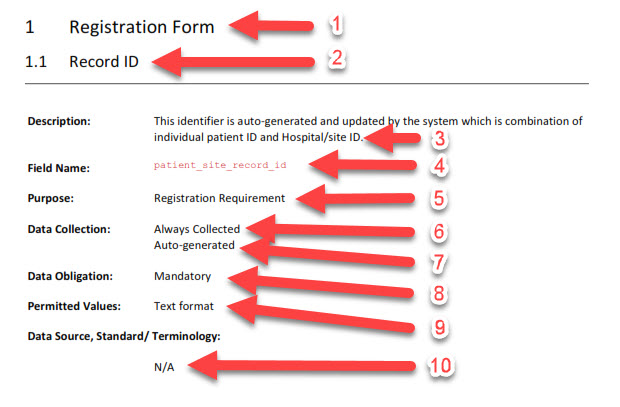
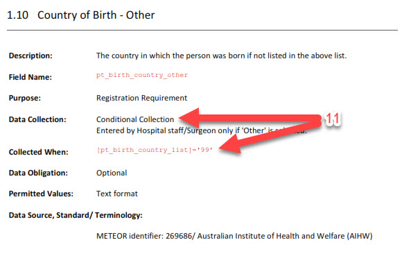
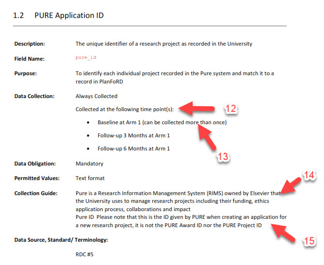
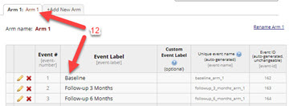
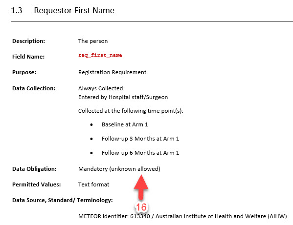
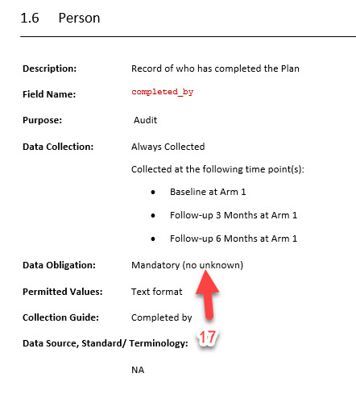
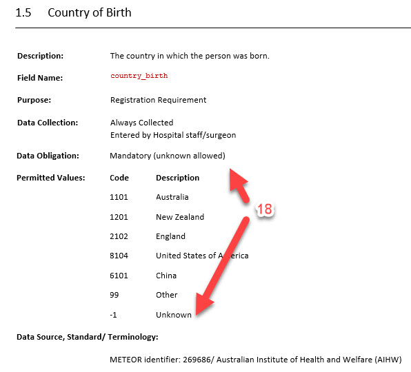

# Word (.docx) export format mapping

This document describes how the **Export to Word** output is generated and how each component in the Word template is populated from REDCap metadata and action tags.

---

## Overview

The generated Word Document is based on the **Helix, Monash University Health Data Dictionary template**, mapped to REDCap field metadata.

---

## 1) Form / Instrument section

| No. | Component                               | Component description                                                                            | How the text is populated                                                                                                                                                                                                                                                                             |
|----:|-----------------------------------------|--------------------------------------------------------------------------------------------------|-------------------------------------------------------------------------------------------------------------------------------------------------------------------------------------------------------------------------------------------------------------------------------------------------------|
|   1 | **Form Name**                           | The name of the data collection instrument                                                       | Extracted from the REDCap instrument/form name                                                                                                                                                                                                                                                        |
|   2 | **Data Element**                        | A name used by researchers to describe the data element                                          | **Default:** REDCap Field Label (e.g., “Record ID”). **Override:** `@DD-ELEMENTNAME="My own name"`. This is useful if the field label includes long instructions that should instead appear in the Collection Guide.                                                                                  |
|   3 | **Description**                         | A concise statement expressing the essential nature of the data element                          | `@DD-FIELDDEF="This identifier is auto generated and updated ..."`                                                                                                                                                                                                                                    |
|   4 | **Field Name**                          | The database column name used for data extract                                                   | REDCap variable/field name                                                                                                                                                                                                                                                                            |
|   5 | **Purpose**                             | Purpose assigned by researchers for collecting the element                                       | `@DD-PURPOSE="Registration Requirement"`                                                                                                                                                                                                                                                              |
|   6 | **Data Collection**                     | Indicates whether the element is always collected, conditionally collected, or system-generated  | Displays **“Always collected”** when there is **no** branching logic; otherwise displays **“Conditional collection”** and also adds a *Collected When* section (see Branching Logic).                                                                                                                 |
|   7 | (Additional note)                       | Optional extra description for Data Collection                                                   | `@DD-DATACOLLECT="Auto-generated"`                                                                                                                                                                                                                                                                    |
|   8 | **Data Obligation**                     | Indicates whether the element is mandatory or optional                                           | Displays **“Mandatory”** if the field is **required** in REDCap; otherwise **“Non-mandatory”**. May append unknown/missing indicator depending on project settings (see **Unknown / Missing Codes** below).                                                                                           |
|   9 | **Permitted Values**                    | Codesets, validation restrictions, formulas or formats required                                  | - Dropdown / Radio / Checkbox: outputs the codeset (excluding hidden choices)  \n- Text validation: outputs validation text (e.g., “Text format”)  \n- Calculated: can include calculation notes via `@DD-CALCDESC="Description of the calculation"`  \n- If `@DEFAULT` exists: display default value |
|  10 | **Data Source, Standard / Terminology** | Indicates standards (METEOR, SNOMED, FHIR, etc.) and/or reference documents used in field design | Use `@DD-STANDARDS="..."` to specify the value                                                                                                                                                                                                                                                        |

---

## 2) Branching Logic

| No. | Component          | How the text is populated                                                                                                                                                                                 |
|----:|--------------------|-----------------------------------------------------------------------------------------------------------------------------------------------------------------------------------------------------------|
|  11 | **Collected When** | If the field contains branching logic, the branching logic expression/code is displayed here. This section appears only when branching logic exists (and Data Collection shows “Conditional collection”). |

---

## 3) Longitudinal setup, repeating instruments/events, and Collection Guide

| No. | Component            | Component description                                                          | How the text is populated                                                                                                     |
|----:|----------------------|--------------------------------------------------------------------------------|-------------------------------------------------------------------------------------------------------------------------------|
|  12 | **Data Collection**  | See “Data Collection” in section 1 above                                       | If the project has longitudinal events, this section displays the event name.  \n           |
|  13 | (Repeating note)     | Indicates repeating form/event collection                                      | If the field is part of a repeating form/event, the text **“(can be collected more than once)”** is displayed.                |
|  14 | **Collection Guide** | Detailed guidance on what should be collected and how it should be interpreted | If `@DD-ELEMENTNAME` is specified, the **REDCap Field Label** is displayed here (to keep the “Data Element” short and clean). |
|  15 | (Field Note)         | Additional guidance displayed under a field in REDCap                          | Displays the REDCap **Field Note** (if specified).                                                                            |

---

## 4) Unknown / Missing Codes

This section documents how the Word export decides whether to display:
- **(unknown allowed)**, or
- **(no unknown)**

### Unknown allowed example:

| No  | Component           | How the text is populated?                                                                                                                                                                                                                                                                                                                            |
|-----|---------------------|-------------------------------------------------------------------------------------------------------------------------------------------------------------------------------------------------------------------------------------------------------------------------------------------------------------------------------------------------------|
| 16. | **Data Obligation** | When the REDCap project specifies a missing code, the text '(unknown allowed)' will be displayed    |

### No unknown example: 

| No  | Component           | How the text is populated?                                                                                                                                                                                                                                                                                                                            |
|-----|---------------------|-------------------------------------------------------------------------------------------------------------------------------------------------------------------------------------------------------------------------------------------------------------------------------------------------------------------------------------------------------|
| 17. |                     | When the missing code is specified but the field contain the action tag <code> @NOMISSING </code>, the text '(no unknown)' will be displayed.  It indicates that the Data Element must be entered in order for the record to be complete.  From a Research Perspective, this means “Not Stated/ Inadequately Described” should not be permitted.                                                                                                                                                                                                           

### Field-level unknown tag example: 

| No  | Component           | How the text is populated?                                                                                                                                                                                                                                                                                                                            |
|-----|---------------------|-------------------------------------------------------------------------------------------------------------------------------------------------------------------------------------------------------------------------------------------------------------------------------------------------------------------------------------------------------|
| 18. |                     | When the REDCap project does not specify a missing code (see 16 above), but the project may have an option for 'Unknown' value as part of a dropdown list or checkboxes, if  (i) you have a standard/ overarching unknown value, e.g. -1 or 99, you can specify it at the Module Configuration.  The EM will match if there is an unknown code as part of the list then it will show the '(unknown allowed)' text.     (ii) you have a different unknown code for this field, you can specify just the tag <code> @DD-UNKNOWN </code>.                                                                                                                                                                                                                                                                                                                                                       

